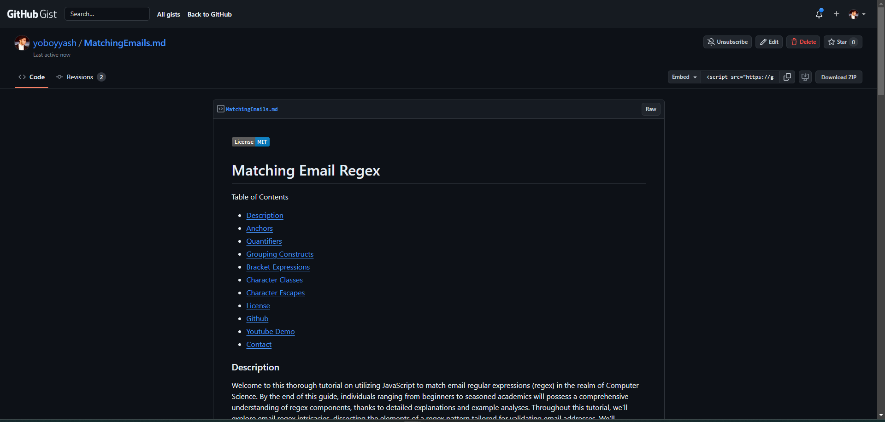

# Regular Expression: Matching an Email

## Matching an Email – /^([a-z0-9_\.-]+)@([\da-z\.-]+)\.([a-z\.]{2,6})$/

Table of Contents
  
  * [Description](#description)
  * [Installation](#installation)
  * [How to use](#usage)
  * [Features](#features)
  * [License](#licenseSection)
  * [Github](#gitHub)
  * [Youtube Demo](#youtube)
  * [Contact](#Contact!)

### Description 
In this Regex Tutorial, you'll delve into validating the highlighted regular expression (regex) for email addresses. Regex Featured in This Tutorial: /^([a-z0-9_.-]+)@([\da-z.-]+).([a-z.]{2,6})$/. The tutorial breaks down each part of the regex, making validation straightforward and clear. By the end, you'll grasp how the regex works to ensure the input matches a valid email address.

### Installation

Firstly, sign in to your GitHub account or create one if you don't have it yet. Then, go to https://gist.github.com/ to initiate a new Gist. In the "Gist description" field, provide a concise title for the challenge. Proceed to add a new file to the Gist by selecting "Add file" and assigning it an appropriate name. Within your freshly created Gist, offer a brief breakdown of the regex, elucidating each component and its role in the email validation procedure. Additionally, discuss potential modifications to the regex to accommodate new requirements, such as permitting uppercase letters or additional special characters in the email address. Once the explanation and modifications are complete, save your Gist by opting for either "Create public Gist" or "Create secret Gist" according to your preference. Share the link to your Gist with others to foster discussions on diverse approaches and interpretations of the regex. By tackling this challenge, you'll not only enhance your comprehension of the email validation regex but also gain proficiency in establishing and disseminating a GitHub Gist.
  
### How to use  

Begin by accessing the deployed GitHub Gist link provided. Take time to read through the introductory paragraph and summary to get an overview of the tutorial's content. Navigate through the table of contents to explore the various sections covered in the tutorial. As you progress, carefully read and understand each component of the regex pattern explained. Finally, apply the knowledge gained from the tutorial to enhance your own projects, ensuring robust validation of email addresses.

### Features 

* User Authentication: The process involves signing in to a GitHub account or creating one if the user doesn't have an existing account, ensuring user authentication and access control.

* Gist Creation: Users are prompted to create a new Gist on GitHub, allowing them to store and share code snippets or explanations easily.

* Regex Explanation: The description outlines a feature where users write a brief explanation of the regex pattern, describing each component's purpose in the email validation process, facilitating understanding and knowledge transfer.

* Collaborative Sharing: The process involves sharing the link to the created Gist with others to encourage collaboration and discussions regarding different approaches and understandings of the regex, fostering a collaborative learning environment.

  
#### Project License: MIT  
https://opensource.org/licenses/MIT

### Github 

https://github.com/yoboyyash/Yash-s-Regex-Js-README  
   
### Youtube 
Youtube demo for this project: 

https://youtube.com 

# Contact me!  

Yash Baviskar: yashrajbaviskar@gmail.com